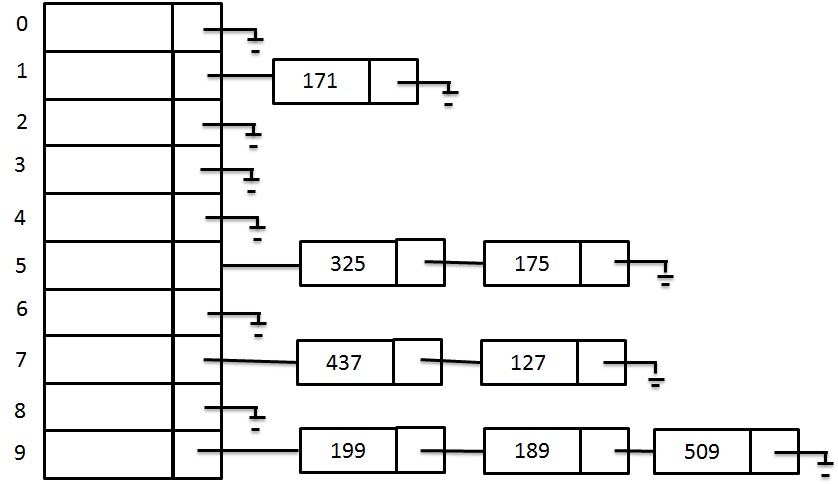
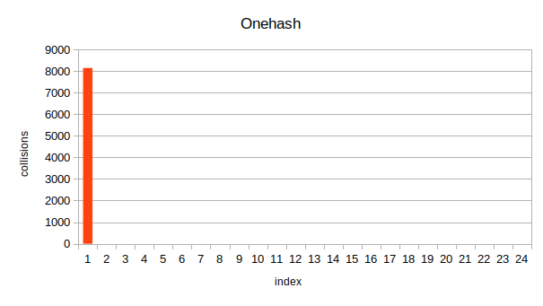
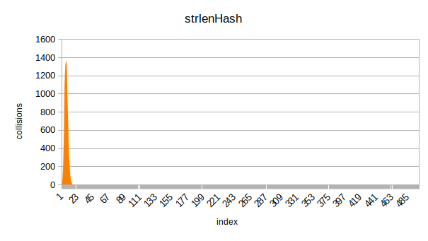
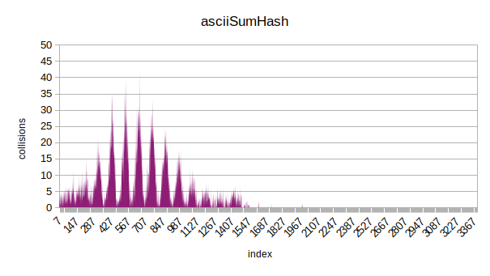
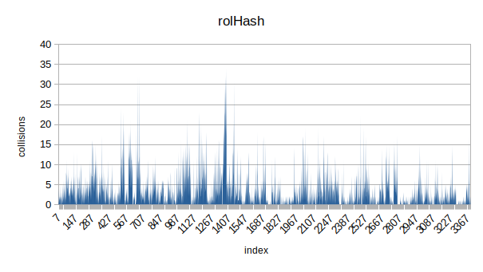
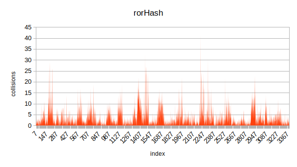
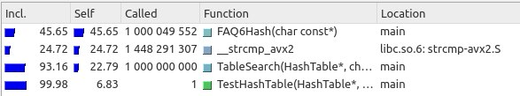
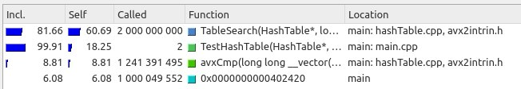

# HashTable
## Introduction

This projects is the part of I.R.Dedinskiy programming course (1st year MIPT DREC). 

**Goals**: \
**1)** implement hash table \
**2)** research several hash functions \
**3)** find some ways to optimize searching

## Hash Tables in general

### What is Hash Table
A hash table is a data structure that is used to store keys/value pairs. 
It uses a hash function to compute an index into an array in which an element will be inserted or searched. By using a good hash function,
hashing can work well. Under reasonable assumptions, the average time required to search for an element in a hash table is O(1).

### Collisions
The situation where a newly inserted key maps to an already occupied slot in the hash table is called **collision** and must be handled using some collision handling technique. 

To solve collisions  i use **separate chaining** technique. \
The idea behind separate chaining is to implement the array as a **linked list** called a chain. \
So, when multiple elements are hashed into the same slot index, these elements are inserted into a singly-linked list (chain). 

img src: https://shorturl.at/dO357

For more detailed information please visit the links below: \
https://en.wikipedia.org/wiki/Hash_table \
https://www.geeksforgeeks.org/separate-chaining-collision-handling-technique-in-hashing 

## Implementation
Main structure HashTable contains its size and pointer to an array of Items. \
Each Item contains a pointer to the head of linked list and list size (amount of keys with same hash value). 
~~~C++
typedef struct HashTable {
    struct Item * tableItems;
    size_t size;
} HashTable;

typedef struct Item {
    struct Node * node;
    size_t peers;
} Item;

typedef struct Node {
    char * string; 
    struct Node* next;
} Node;
~~~

Since one of the goals is to research some hash functions and draw diagrams, the size of Hash Table is chosen in such way, that with decent hash function average length of linked list will be 4-6 (for easy display on charts).

## Researched Hash Functions
All 7 researched Hash Functions with short descriptions and diagrams.

### 1. OneHash
Trivial and obviously very bad Hash Function. Returns one in any case.
~~~C++
size_t OneHash(const char * word) {
    return 1;
}
~~~

No comments here ;)

### 2. AsciiHash
Returns the ascii code of first char in given string.
~~~C++
size_t AsciiHash(const char * word) {
    return *word;
}
~~~

detailed AsciiHash

Better than OneHash but still quite bad.
 
### 3. StrlenHash
Returns the length of given string.
~~~C++
size_t StrlenHash(const char * word) {
    return strlen(word);
}
~~~

detailed StrlenHash

As we can see, it is not really good Hash Functions either. Most of the word's length is 5 - 15.

### 4. AsciiSumHash
Return sum of all ascii codes in given string.
~~~C++
size_t AsciiSumHash(const char * word) {
    size_t sum = 0;
    while (*word) {
        sum += *word;
        word++;
    }
    return sum;
}
~~~

Already better. The first half of distribution doesn't look that bad at all.

### 5. rolHash
Return the value calculated by following sequence: \
$H_0$ = 0 \
$H_{i+1}$ = RolFunc($H_i$, 1) ^ string[i] \
where RolFunc(size_t num, int shift) fully replicates assembly rol function.

If you are not familiar with rol and ror assembly functions, please visit the link below: \
https://stackoverflow.com/questions/34842417/what-does-asm-ror-do

~~~C++
size_t rolHash(const char * word) {

    size_t hash = 0, n = strlen(word);

    for (size_t i = 0; i < n; i++) {
        hash = RolFunc(hash) ^ word[i]; 
    }

    return hash;
}

size_t RolFunc (size_t num) {                                 // 10011000 ----> 0011001
    return (num << 1) | (num >> (sizeof(num) * 8 - 1));
}
~~~

Definitely the best so far. I wouldn't call it "even distribution", but at least it spreads along the whole Hash Table.

### 6. rorHash
Very similar to rolHash, but uses RorFunc(size_t num, int shift) instead of RolFunc.

~~~C++
size_t rorHash(const char * word) {

    size_t hash = 0, n = strlen(word);

    for (size_t i = 0; i < n; i++) {
        hash = RorFunc(hash) ^ word[i]; 
    }

    return hash;
}

size_t RorFunc (size_t num) {                                 // 011000001 ---> 10110000 
    return (num >> 1) | (num << (sizeof (num) * 8 - 1));
}
~~~

As we can see, the distribution looks similar to rolHash one. Still not really even but full-ranged.

### 7. FAQ6Hash

At the end I decided to make a diagram for quite famous Jenkins hash function FAQ6. \
Check the following link to learn about it:

https://en.wikipedia.org/wiki/Jenkins_hash_function

~~~C++
size_t FAQ6Hash(const char * word) {

    size_t hash = 0;

    for (; *word; word++)
    {
        hash += (unsigned char)(*word);
        hash += (hash << 10);
        hash ^= (hash >> 6);
    }
    hash += (hash << 3);
    hash ^= (hash >> 11);
    hash += (hash << 15);

    return hash;

}
~~~

The last and obviously the best. The distribution is quite even and full-ranged.

### Research conclusion
Here are dispersion values for each hash function: 

| Hash Function | oneHash | strlenHash | asciiHash | AsciiSumHash | rorHash | rolHash | FAQ6Hash |
|---------------|---------|------------|-----------|--------------|---------|---------|----------|
| dispersion    | 12112   | 1534       | 530       | 20,4         | 9,7     | 7,4     | 2,4      |

Let's order them according to their performance:

1) FAQ6Hash 
2) rolHash  
3) rorHash  
4) AsciiSumHash 
5) AsciiHash  
6) StrlenHash 
7) OneHash

## Search optimization 

Let's try to optimize search in out Hash Table. 

**Testing method:** \
Each test consists of a series of 10 trials, in each of which the search function runs $10^8$ times, going through all the words in the Hash Table.
Then the mean time of all 10 trials is calculated (using <time.h>) and put in log file. 

## Let's get started!

I decided to stick with FAQ6 hash function since it outperformed the rest hash functions in terms of distribution. 

Here's what a valgrind profiler tells us:

First thing to notice is that even without any optimization flags compiler uses strcmp_avx instead of ordinary strcmp. Also we can see that FAQ6Hash takes significantly more time than strcmp_avx (45.6% vs 24.72%). So let's start with optimizing the FAQ6Hash itself! 

### FAQ6Hash optimization

Let's take a closer look at this function. The whole hashing algorithm might be quite easily converted to assembly code. Indeed, it consists of bitwise shifts and xor instructions. So, why don't we just code our algorithm on assembler?

**Note**: following code is written on NASM assembly.

FAQ6Hash assembly code

~~~asm
    
section .text
global _FAQ6

_FAQ6:
        movzx   eax, BYTE [rdi]
        test    al, al
        je      .null
        xor     edx, edx
.lp:
        add     rax, rdx
        add     rdi, 1
        mov     rdx, rax
        sal     rdx, 10
        add     rax, rdx
        mov     rdx, rax
        shr     rdx, 6
        xor     rdx, rax

        movzx   eax, BYTE [rdi]
        test    al, al
        jne     .lp

        lea     rax, [rdx+rdx*8]
        mov     rdx, rax
        shr     rdx, 11
        xor     rdx, rax
        mov     rax, rdx
        sal     rax, 15
        add     rax, rdx

        ret

.null:
        xor     eax, eax
        ret
~~~

Let's run tests with and without the "-O2" optimization flag.

| Without "-O2" flag| search time, s | Speed Up (of default) |
|----------------|----------------|-----------------------|
| default FAQ6   | 4,794          | 1                     |
| fully asm FAQ6 | 3,789          | 1,265                 |

|With "-O2" flag | search time, s | Speed Up (of default) |
|----------------|----------------|-----------------------|
| default FAQ6   | 3,519          | 1                     |
| fully asm FAQ6 | 3,518          | 1                     |

As we can see, our optimization can compete with "-O2" flag but can't really beat it. 

Note that another significant function within the search function is the comparison of keys. Since our hash table has not really optimal size (the reason was stated in the first part), we have quite a few collisions. And collisions cause comparisons. So it would be good to find the way to optimize comparison function.

### Inline strcmp

Let's write our own strcmp function using asm insertion.

strcmp asm insertion

    
~~~C++
asm(
        ".intel_syntax noprefix\n\t"

            "mov rsi, %1\n\t"
            "mov rdi, %2\n\t"

        "loop%=:\n\t"
        
            "mov al, byte ptr [rsi]\n\t"
            "mov bl, byte ptr [rdi]\n\t"

    	    "cmp al, 0\n\t"
    	    "je end%=\n\t"
    	    "cmp bl, 0\n\t"
    	    "je end%=\n\t"

    	    "cmp al, bl\n\t"
    	    "jne end%=\n\t"

    	    "inc rdi\n\t"
    	    "inc rsi\n\t"
    	    "jmp loop%=\n\t"

        "end%=:\n\t"
    	    "sub al, bl\n\t"
    	    "mov %0, eax\n\t"

        ".att_syntax prefix" 
        : "=r" (result)
        : "r" (str1), "r" (str2)
        : "rax", "rbx", "rsi", "rdi"
    );

   
~~~
    

Let's run and test it!

| With "-O2" flag      | search time, s | relative Speed Up (of default) | absolute Speed up* |
|----------------------|----------------|--------------------------------|--------------------|
| default FAQ6  strcmp | 4.427          | 1                              |    0.795           |
| fully asm FAQ6 insertCmp| 4.429       | 1                              |    0.795           |

*of default FAQ6 with "-O2" & strcmp

As we can see, it's hard to call it optimization... insertCmp function we wrote doesn't stand a chance against fast strcmp_avx used by compiler. Therefore we will not use it in the following test. We need to think of another way to optimize the comparison function.

Let's increase the size of all char arrays that hold our words to 32 bytes (since according to text analysis, maximum word length is 18). 
And now we can write our own comparison function using avx instructions.

### AVX comparison

Now as all of our char arrays are 32 bytes long, it's very convenient to load them in __m256i bit vectors and compare all bytes simultaneously. New comparison function looks like this:

~~~C++
int avxCmp(__m256i* str1, __m256i* str2) {

    __m256i first = *str1;
    __m256i second = *str2;
    
    __m256i cmp = _mm256_cmpeq_epi8 (first, second);
    int mask = _mm256_movemask_epi8 (cmp);

    return (mask - 0xffffffff);
}

~~~

Let's run tests once again:

| With "-O2" flag   | search time, s | relative Speed up     | absolute Speed up*        |
|-------------------|----------------|-----------------------|---------------------------|
| default FAQ6   AVX| 2,161          | 1                     |    1,628                  |
| fully asm FAQ6 AVX| 2,127          | 1,016                 |    1,654                  |

*of default FAQ6 with "-O2" NO_AVX

So, the current best for now is fully asm FAQ6 with hand written avxCmp function.

Now let's try something completely different: what if we replace our FAQ6Hash function with built in CRC32 hash? 

### Implementation of CRC32

Let's analyze CRC32 before using it.

CRC32 asm code

~~~asm
    
    section .text
    global crc32

    crc32:
        xor     rax, rax
        crc32   rax, qword [rdi]
        crc32   rax, qword [rdi+8]
        crc32   rax, qword [rdi+16]
        crc32   rax, qword [rdi+24]
    
        ret

~~~

Here is the diagram for CRC32:

The dispersion of CRC32 is **1.8** (against **2.4** of FAQ6Hash). So, as we can see, CRC32 outperforms FAQ6Hash in terms of distribution.

And now let's run some tests! 

|   With "-O2" flag | search time, s | relative Speed Up                    | absolute Speed up* 
|-------------------|----------------|--------------------------------------|-----------------------------------------------------
| fully asm FAQ6 AVX| 2,127          | 1                                    | 1,654
| _crc32         AVX| 1,183          | 1,798                                | 2,975

*of default FAQ6 with "-O2" NO_AVX

As expected, CRC32 implementation really speeds our search up. So, now we have very fast hash function and quite good comparison function. The only thing left is to change the size of our Hash Table to reduce collisions. 

### Changing Hash Table Size

Let's increase our Hash Table size by a factor of 1.5 (I've tried several variants and this scale factor gives the best speed up):

|    With "-O2" flag | search time, s | relative Speed Up     | absolute Speed up* 
|--------------------|----------------|-----------------------|-----------------------------------------------------
| _crc32 AVX OLD_SIZE| 1,183          | 1                     | 2,975
| _crc32 AVX NEW_SIZE| 1,159          | 1,021                 | 3,036

*of default FAQ6 with "-O2" NO_AVX OLD_SIZE

So, we could get over a 3x speed up factor! Note that our last optimization didn't improve the performance that much, therefore we have reason to believe that our optimizations are approaching the limit.

Let's take one last look at the profiler:

                                                                                                                 
As we can see, avxCmp now takes less than 9% (we've started with 24.72%).                                                        

## Conclusion

In this project we implemented our own Hash Table, researched 7 Hash Functions (8 with CRC32), ranked them according to their performance. \
After that we tried to optimize table search function using 5 general approaches: 

1) assembly insertions
2) fully written on nasm hash function
3) avx instructions 
4) changing hash function
5) changing Hash Table size

As a result, we could speed up the searching in our Hash Table by approximately 3 times.

