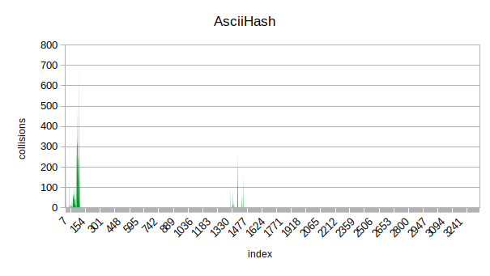

# HashTable
## Introduction

This projects is part of I.R.Dedinskiy programming course (1st year MIPT DREC). \
**Goals**: \
**1)** implement hash table \
**2)** research several hash functions \
**3)** find some ways to optimize searching

## Hash Tables in general

### What is Hash Table
A hash table is a data structure that is used to store keys/value pairs. 
It uses a hash function to compute an index into an array in which an element will be inserted or searched. By using a good hash function,
hashing can work well. Under reasonable assumptions, the average time required to search for an element in a hash table is O(1).

### Collisions
The situation where a newly inserted key maps to an already occupied slot in the hash table is called **collision** and must be handled using some collision handling technique. 

To solve collisions  i use **separate chaining** technique. \
The idea behind separate chaining is to implement the array as a **linked list** called a chain. \
So, when multiple elements are hashed into the same slot index, these elements are inserted into a singly-linked list which is known as a chain.

For more detailed information please visit the links below: \
https://en.wikipedia.org/wiki/Hash_table \
https://www.geeksforgeeks.org/separate-chaining-collision-handling-technique-in-hashing 

## Implementation
Main structure HashTable contains its size and pointer to an arrar of Items. \
Each Item contains a pointer to the head of linked list and list size (amount of keys with same hash value). 
~~~C++
typedef struct HashTable {
    struct Item * tableItems;
    size_t size;
} HashTable;

typedef struct Item {
    struct Node * node;
    size_t peers;
} Item;

typedef struct Node {
    char * string; 
    struct Node* next;
} Node;
~~~

Since one of the goals is to research some hash functions and draw diagrams, the size of Hash Table is chosen in such way, that with decent hash function average lenght of linked list will be 6-8 (for easy display on charts).

## Researched Hash Functions
All 7 researched Hash Functions with short descriptions and diagrams.

### 1. OneHash
Trivial and obviously very bad Hash Function. Returns one in any case.
~~~C++
size_t OneHash(const char * word) {
    return 1;
}
~~~

No comments here ;)

### 2. AsciiHash
Returns the ascii code of first char in given string.
~~~C++
size_t AsciiHash(const char * word) {
    return *word;
}
~~~

Better than OneHash but still quite bad.
 
### 3. StrlenHash
Returns the lenght of given string.
~~~C++
size_t StrlenHash(const char * word) {
    return strlen(word);
}
~~~

As we can see, it is not really good Hash Functions either. Most of the word's lenght is 5 - 15.

### 4. AsciiSumHash
Return sum of all ascii codes in given string.
~~~C++
size_t AsciiSumHash(const char * word) {
    size_t sum = 0;
    while (*word) {
        sum += *word;
        word++;
    }
    return sum;
}
~~~

Already better. The first half of distribution doesn't look that bad at all.

### 5. rolHash
Return the value calculated by following sequence: \
$H_0$ = 0 \
$H_{i+1}$ = RolFunc($H_i$, 1) ^ string[i] \
where RolFunc(size_t num, int shift) fully replicates assembly rol function.

If you are not familiar with rol and ror assembly functions, please visit the link below: \
https://stackoverflow.com/questions/34842417/what-does-asm-ror-do

~~~C++
size_t rolHash(const char * word) {

    size_t hash = 0, n = strlen(word);

    for (size_t i = 0; i < n; i++) {
        hash = RolFunc(hash, 1) ^ word[i]; 
    }

    return hash;
}

size_t RolFunc (size_t num, int shift) {                                 // 10011000 ----> 0011001
    return (num << shift) | (num >> (sizeof (uint32_t) - shift));
}
~~~

Definetely the best so far. I wouldn't call it "even distribution", but at least it spreads along the whole Hash Table.

### 6. rorHash
Very similar to rolHash, but uses RorFunc(size_t num, int shift) instead of RolFunc.

~~~C++
size_t rorHash(const char * word) {

    size_t hash = 0, n = strlen(word);

    for (size_t i = 0; i < n; i++) {
        hash = RorFunc(hash, 1) ^ word[i]; 
    }

    return hash;
}

size_t RorFunc (size_t num, int shift) {                                 // 011000001 ---> 10110000 
    return (num >> shift) | (num << (sizeof (uint32_t) - shift));
}
~~~

As we can see, the distribution looks similar to rolHash one. Still not really even but full-ranged.

### 7. FAQ6Hash

At the end I decided to make a diagram for quite famous Jenkins hash function FAQ6. \
Check the following link to learn about it: \
https://en.wikipedia.org/wiki/Jenkins_hash_function

~~~C++
size_t FAQ6Hash(const char * word) {

    size_t hash = 0;

    for (; *word; word++)
    {
        hash += (unsigned char)(*word);
        hash += (hash << 10);
        hash ^= (hash >> 6);
    }
    hash += (hash << 3);
    hash ^= (hash >> 11);
    hash += (hash << 15);

    return hash;

}
~~~

The last and obviously the best. The distribution is quite even and full-ranged.

### Research conclusion
So, the diagrams were made for 7 Hash Functions. \
Let's order them according to their performane:

1) FAQ6Hash 
2) rolHash  
3) rorHash  
4) AsciiSumHash 
5) AsciiHash  
6) StrlenHash 
7) OneHash

