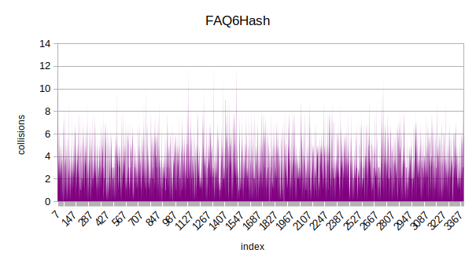

# HashTable
## Introduction

This projects is part of I.R.Dedinskiy programming course (1st year MIPT DREC). \
**Goals**: \
**1)** implement hash table \
**2)** research several hash functions \
**3)** find some ways to optimize searching

## Hash Tables in general

### What is Hash Table
A hash table is a data structure that is used to store keys/value pairs. 
It uses a hash function to compute an index into an array in which an element will be inserted or searched. By using a good hash function,
hashing can work well. Under reasonable assumptions, the average time required to search for an element in a hash table is O(1).

### Collisions
The situation where a newly inserted key maps to an already occupied slot in the hash table is called **collision** and must be handled using some collision handling technique. 

To solve collisions  i use **separate chaining** technique. \
The idea behind separate chaining is to implement the array as a **linked list** called a chain. \
So, when multiple elements are hashed into the same slot index, these elements are inserted into a singly-linked list which is known as a chain.

For more detailed information please visit the links below: \
https://en.wikipedia.org/wiki/Hash_table \
https://www.geeksforgeeks.org/separate-chaining-collision-handling-technique-in-hashing 

## Implementation
Main structure HashTable contains its size and pointer to an arrar of Items. \
Each Item contains a pointer to the head of linked list and list size (amount of keys with same hash value). 
~~~C++
typedef struct HashTable {
    struct Item * tableItems;
    size_t size;
} HashTable;

typedef struct Item {
    struct Node * node;
    size_t peers;
} Item;

typedef struct Node {
    char * string; 
    struct Node* next;
} Node;
~~~

Since one of the goals is to research some hash functions and draw diagrams, the size of Hash Table is chosen in such way, that with decent hash function average lenght of linked list will be 4-6 (for easy display on charts).

## Researched Hash Functions
All 7 researched Hash Functions with short descriptions and diagrams.

### 1. OneHash
Trivial and obviously very bad Hash Function. Returns one in any case.
~~~C++
size_t OneHash(const char * word) {
    return 1;
}
~~~

No comments here ;)

### 2. AsciiHash
Returns the ascii code of first char in given string.
~~~C++
size_t AsciiHash(const char * word) {
    return *word;
}
~~~

Better than OneHash but still quite bad.
 
### 3. StrlenHash
Returns the lenght of given string.
~~~C++
size_t StrlenHash(const char * word) {
    return strlen(word);
}
~~~

As we can see, it is not really good Hash Functions either. Most of the word's lenght is 5 - 15.

### 4. AsciiSumHash
Return sum of all ascii codes in given string.
~~~C++
size_t AsciiSumHash(const char * word) {
    size_t sum = 0;
    while (*word) {
        sum += *word;
        word++;
    }
    return sum;
}
~~~

Already better. The first half of distribution doesn't look that bad at all.

### 5. rolHash
Return the value calculated by following sequence: \
$H_0$ = 0 \
$H_{i+1}$ = RolFunc($H_i$, 1) ^ string[i] \
where RolFunc(size_t num, int shift) fully replicates assembly rol function.

If you are not familiar with rol and ror assembly functions, please visit the link below: \
https://stackoverflow.com/questions/34842417/what-does-asm-ror-do

~~~C++
size_t rolHash(const char * word) {

    size_t hash = 0, n = strlen(word);

    for (size_t i = 0; i < n; i++) {
        hash = RolFunc(hash) ^ word[i]; 
    }

    return hash;
}

size_t RolFunc (size_t num) {                                 // 10011000 ----> 0011001
    return (num << 1) | (num >> (sizeof(num) * 8 - 1));
}
~~~

Definetely the best so far. I wouldn't call it "even distribution", but at least it spreads along the whole Hash Table.

### 6. rorHash
Very similar to rolHash, but uses RorFunc(size_t num, int shift) instead of RolFunc.

~~~C++
size_t rorHash(const char * word) {

    size_t hash = 0, n = strlen(word);

    for (size_t i = 0; i < n; i++) {
        hash = RorFunc(hash) ^ word[i]; 
    }

    return hash;
}

size_t RorFunc (size_t num) {                                 // 011000001 ---> 10110000 
    return (num >> 1) | (num << (sizeof (num) * 8 - 1));
}
~~~

As we can see, the distribution looks similar to rolHash one. Still not really even but full-ranged.

### 7. FAQ6Hash

At the end I decided to make a diagram for quite famous Jenkins hash function FAQ6. \
Check the following link to learn about it:

https://en.wikipedia.org/wiki/Jenkins_hash_function

~~~C++
size_t FAQ6Hash(const char * word) {

    size_t hash = 0;

    for (; *word; word++)
    {
        hash += (unsigned char)(*word);
        hash += (hash << 10);
        hash ^= (hash >> 6);
    }
    hash += (hash << 3);
    hash ^= (hash >> 11);
    hash += (hash << 15);

    return hash;

}
~~~

The last and obviously the best. The distribution is quite even and full-ranged.

### Research conclusion
Here are dispersion values for each hash function: 

| Hash Function | oneHash | strlenHash | asciiHash | AsciiSumHash | rorHash | rolHash | FAQ6Hash |
|---------------|---------|------------|-----------|--------------|---------|---------|----------|
| dispersion    | 12112   | 1534       | 530       | 20,4         | 9,7     | 7,4     | 2,4      |

Let's order them according to their performance:

1) FAQ6Hash 
2) rolHash  
3) rorHash  
4) AsciiSumHash 
5) AsciiHash  
6) StrlenHash 
7) OneHash

## Search optimization 

Let's try to optimize our search function. 

**Testing method:** \
Each test consists of a series of 10 trials, in each of which the search function runs 100000000 times, going through all the words in the Hash Table.
Then the mean time of all 10 trials is calculated (using <time.h>) and put in log file. 

## Let's get started!

I decided to start by working with ROL Hash function. I really like its simplicity and decent performance.

### rolHash optimization 

Here's what a valgrind profiler tells us:

First thing to notice is that compiler uses strcmp_avx instead of ordinary strcmp, and it still weights more than our rolHash function. Despite the fact that rolHash is very simple and fast already, let's try to optimize it anyway! 

First of all, let's make an interesting observation using our favorite and familiar godbolt: 

https://godbolt.org/ (extremely useful site to explore your compiler)

Let's put our RolFunc() in there: \
 \
Wow! Even without any optimization flags compiler replaces our hand-written C RolFunc with assembler one. So, to start somewhere, let's replace С RolFunc by ourselves.
~~~asm
section .text
global _RolFunc

_RolFunc:
           mov rax, rdi   ; first arg
           rol rax, 1

           ret 
~~~
And now our RolHash function looks like this:
~~~C++
size_t rolHashAsmROL(const char * word) {

    size_t hash = 0;

    for (; *word; word++) {
        hash = _RolFunc(hash) ^ (*word);
    }
    return hash;
}
~~~

Let's run our tests without any optimization flags and compare this version with default one:

|                | search time, s | Speed Up (of default) |
|----------------|----------------|-----------------------|
| default        | 4,281          | 1                     |
| asm Rol        | 4,100          | 1,044                 |

Not really impressive, but we didn't do much to be honest. Basically we just removed prologue and epilogue from our Rol function. \
But we're just getting started ;)

Now let's look at our rolHash function even more closely. The whole hashing algorithm might be quite easily converted to assembly code. Indeed, it consits of Rol and Xor instructions. So, why don't we just code our algorithm on assembler? Let's do it two ways: using asm insertion and fully writing hash function on asm. 

Asm insertion

~~~C++
size_t asmInsertRolHash(const char* word) {
    size_t hash = 0;

    for (; *word; word++) {
        asm (
            ".intel_syntax noprefix\n\t"
            "mov rax, %1 \n\t"
            "rol rax\n\t"
            "movsx rbx, BYTE PTR[%2]\n\t"
            "xor rax, rbx\n\t"
            "mov %0, rax\n\t"
            ".att_syntax prefix\n\t" 
            : "=r"(hash)
            : "r"(hash), "r"(word)
            : "%rax", "%rbx"    
        );
    }

    return hash;
}
~~~

Fully asm hash functions

~~~asm
section .text
global _RolHash

_RolHash:   
            xor rax, rax
            movsx rdx, BYTE [rdi]   ; first arg is string
            test dl, dl             ; if char = 0
            je done

RolFunc:    rol rax, 1
            xor rax, rdx 

            inc rdi
            movsx rdx, BYTE [rdi]
            test dl, dl
            jne RolFunc

            ret

done:
            mov eax, 0
            ret 
~~~

Let's run tests with no optimization flags and compare results:

|                | search time, s | Speed Up (of default) |
|----------------|----------------|-----------------------|
| asm insertion  | 3,998          | 1,070                 |
| fully asm hash | 3,303          | 1,300                 |

Already more significant then previous version. As we can see in our case fully asm hash function performs better than asm insertion.

So, let's sum up what we have so far: 

**Wihout any optimization flags**

|                | search time, s | Speed Up (of default) |
|----------------|----------------|-----------------------|
| default rolHash       | 4,281          | 1                     |
| asm RolFunc        | 4,100          | 1,044                 |
| asm insertion  | 3,998          | 1,070                 |
| fully asm rolHash | 3,303          | 1,300                 |

And what will happen if we run all our tests with "-O2" flag? (arguably the best flag in terms of compile time & safety & performance) 

**With "-O2" flag:**

|                | search time, s | Speed Up (of default) |
|----------------|----------------|-----------------------|
| default rolHash        | 3,019          | 1                     |
| asm RolFunc        | 3,076          | 0,981                 |
| asm insertion  | 2,972          | 1,02                  |
| fully asm rolHash | 3,019          | 1                     |

This may seem strange at first sight. Asm insertion performs better than fully asm hash function. Here's what I think about this.
Our fully asm hash function is written on NASM assembler. We compile it using "nasm -f ...", and then link it with the rest of obj files using g++. So, the optimization in this case is done by nasm (the "-Ox" nasm optimization flag is default since NASM 2.09). Check the following link to learn more about nasm optimization options: \
https://nasm.us/doc/nasmdoc2.html                           

On the other hand, the GNU uses GAS assembler. And when we use asm insertion, we just implement written on GAS asm code directly to the rest GNU generated GAS code. So it is still optimized by very powerful GNU optimizer. I suppose the optimization done by GNU is stronger than the NASM one. For this reason with "-O2" hash function with asm insertion performs better than the same function fully written on nasm.

### Let's go even further

Note that another significant function within the search function is the comparison of keys (strcmp). In our case it takes even more time than hash function itself. Since our hash table has not really optimal size (the reason was stated in the first part), we have quite a few collisions. And collisions cause comparisons. So it would be good to find some way to optimize comparing function. 

Let's just increase the size of all words up to 32 bytes (since according to text analysis, maximum word length is 18). 
And now we can write our own compare function using avx instructions.

### AVX instructions

Now as all of our words are 32 bytes long, it's very convenient to load them in __m256i bit vectors and compare all bytes simultaneously. New compare function looks like this:

~~~C++
int avxCmp(__m256i* str1, __m256i* str2) {

    __m256i first = *str1;
    __m256i second = *str2;
    
    __m256i cmp = _mm256_cmpeq_epi8 (first, second);
    int mask = _mm256_movemask_epi8 (cmp);

    return (mask - 0xffffffff);
}

~~~

Let's run tests once again:

**With "-O2" flag**

|                | search time, s | Speed Up (of default) |
|----------------|----------------|-----------------------|
| default rolHash AVX       | 1,830          | 1                     |
| asm RolFunc   AVX        | 1,862          | 0,983                 |
| asm insertion AVX  | 1,817          | 1,007                 |
| fully asm rolHash AVX| 1,812          | 1,010                 |

As we can see, implementing avxCmp really improved our performance.

**With "-O2" flag**

|                       | search time, s | Speed Up (of default) |
|-----------------------|----------------|---------------------------|
| default rolHash   NO_AVX | 3,019          | 1                         |
| default rolHash   AVX | 1,830          | 1.650                         |
| asm RolFunc   AVX | 1,862          | 1,621                     |
| asm insertion AVX | 1,817          | 1,662                     |
|  fully asm rolHash AVX| 1,812          | 1,666                     |

I suppose that's everything we could achieve in optimization of simple ROL hash function. So let's move on to something more serious for futher ideas.

### FAQ6Hash optimization

Using callgrind with FAQ6Hash we see slightly different picture:

As we can see, unlike the previous case, FAQ6Hash takes significantly more time than strcmp (45.6% vs 24.72%). So optimizing the hash function itself might really help.

Let's write FAQ6 hash function fully on asm and run some tests:

FAQ6Hash assembly code

~~~asm
section .text
global _FAQ6

_FAQ6:
        movzx   eax, BYTE [rdi]
        test    al, al
        je      .null
        xor     edx, edx
.lp:
        add     rax, rdx
        add     rdi, 1
        mov     rdx, rax
        sal     rdx, 10
        add     rax, rdx
        mov     rdx, rax
        shr     rdx, 6
        xor     rdx, rax

        movzx   eax, BYTE [rdi]
        test    al, al
        jne     .lp

        lea     rax, [rdx+rdx*8]
        mov     rdx, rax
        shr     rdx, 11
        xor     rdx, rax
        mov     rax, rdx
        sal     rax, 15
        add     rax, rdx

        ret

.null:
        xor     eax, eax
        ret
~~~

**Without "-O2" flag**

|                | search time, s | Speed Up (of default) |
|----------------|----------------|-----------------------|
| default FAQ6   | 4,794          | 1                     |
| fully asm FAQ6 | 3,789          | 1,265                 |

**With "-O2" flag**

|                | search time, s | Speed Up (of default) |
|----------------|----------------|-----------------------|
| default FAQ6   | 3,519          | 1                     |
| fully asm FAQ6 | 3,518          | 1                     |

As we can see, our optimization can compete with "-O2" flag but can't really beat it. So now let's do something with our compare function.

### AVX compare

As in our previous case, let's implement avxCmp function and see the results:

**With "-O2" flag**

|                   | search time, s | Speed Up (of default) |
|-------------------|----------------|-----------------------|
| default FAQ6   AVX| 2,161          | 1                     |
| fully asm FAQ6 AVX| 2,127          | 1,016                 |

Now let's sum up the results:

**With "-O2" flag**

|                       | search time, s | Speed Up (of default) |
|-----------------------|----------------|---------------------------|
| default FAQ6   NO_AVX | 3,519          | 1                         |
| fully asm FAQ6 NO_AVX | 3,518          | 1                         |
| default FAQ6      AVX | 2,161          | 1,628                     |
| fully asm FAQ6    AVX | 2,127          | 1,654                     |

So, the current best for now is fully asm FAQ6 with hand written avxCmp function.

Now let's try something completely different: what if we replace our FAQ6Hash function with built in CRC32 hash? Let's try it out!

CRC32 asm code

~~~asm
    
    section .text
    global crc32

    crc32:
        xor     rax, rax
        crc32   rax, qword [rdi]
        crc32   rax, qword [rdi+8]
        crc32   rax, qword [rdi+16]
        crc32   rax, qword [rdi+24]
    
        ret

~~~

|                   | search time, s | relative Speed Up     | absolute Speed up (of default FAQ6 with "-O2" NO_AVX)
|-------------------|----------------|-----------------------|-----------------------------------------------------
| fully asm FAQ6 AVX| 2,127          | 1                     | 1,654
| _crc32         AVX| 1,183          | 1,798                 | 2,975

As expected, CRC32 implementation really speeds our search up. So, now we have very fast hash function and quite good comparison function. The only thing left is to change the size of our Hash Table to reduce collisions. 

### Changing Hash Table Size

Let's increase our Hash Table size by a factor of 1.5 (I've tried several variants and this scale factor gives the best speed up):

|                    | search time, s | relative Speed Up     | absolute Speed up (of default FAQ6 with "-O2" NO_AVX OLD_SIZE)
|--------------------|----------------|-----------------------|-----------------------------------------------------
| _crc32 AVX OLD_SIZE| 1,183          | 1                     | 2,975
| _crc32 AVX NEW_SIZE| 1,159          | 1,021                 | 3,036

So, we could get over a 3x speed up factor! Note that last optimization didn't improve the performance that much, therefore we have reason to believe that our optimizations are approaching the limit. 

## Conclusion

In this project we implemented our own Hash Table, researched 7 Hash Functions, ranked them according to their performance. \
After that we tried to optimize table search function using 5 general approaches: \
1) assembly insertions
2) fully written on asm functions
3) avx instructions 
4) changing to better hash functions
5) changing Hash Table size

As a result, we could outperform the "-O2" compiler flag by approximately 3 times.

